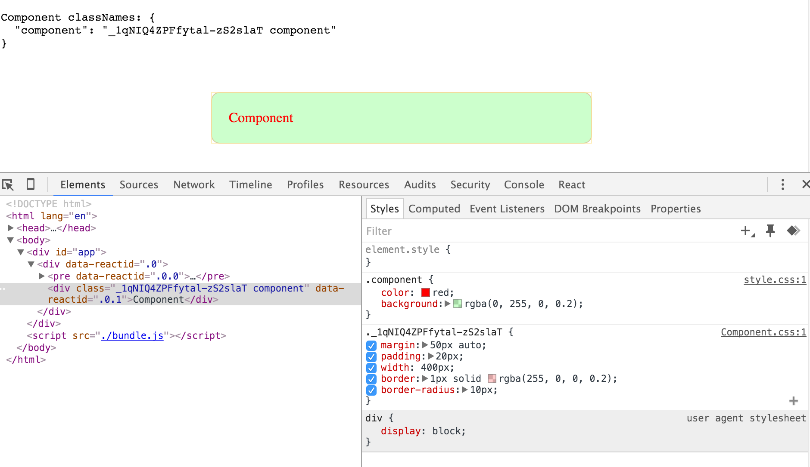

# css-modules-component-template

[](https://gitter.im/nkbt/help)

[](https://circleci.com/gh/nkbt/css-modules-component-template)
[](https://david-dm.org/nkbt/css-modules-component-template)
[](https://david-dm.org/nkbt/css-modules-component-template#info=devDependencies)

Styled UI component template with CSS-Modules


## Usage

```sh
npm install --save css-modules-component-template
```

## Example app

```js
import Component from 'css-modules-component-template';

// Add global ".component" class name to Component without overriding original one
Component.css.component = `${Component.css.component} component`;

const App = React.createClass({
  render() {
    return (
      <div>
        <pre>
          Component classNames: {JSON.stringify(Component.css, null, 2)}
        </pre>
        <Component />
      </div>
    );
  }
});

```

NOTE: you will need to copy `css-modules-component-template/lib/Component.css` to your assets folder if you do not use any sort of build process for css.

Basic browserify build scripts in package.json:

```json
  "scripts: {
    "prebuild": "cp -f node_modules/css-modules-component-template/lib/Component.css ./public/Component.css",
    "build": "browserify index.js -t babelify --outfile ./public/bundle.js"
  }
```

If you are using css build process you can simply require `Component.css` in your module:

```js
import Component from 'css-modules-component-template';

import 'css-modules-component-template/lib/Component.css';
import './styles.css';

Component.css.component = `${Component.css.component} component`;

const App = React.createClass({
  // ...
});
```

## Demo app

Github:

[https://github.com/nkbt/css-modules-component-template-test](https://github.com/nkbt/css-modules-component-template-test)

Published to Github Pages pre-built example:

[http://nkbt.github.io/css-modules-component-template-test] (http://nkbt.github.io/css-modules-component-template-test)

## Rendered lib Component

With original css-modules class and app-specific override


